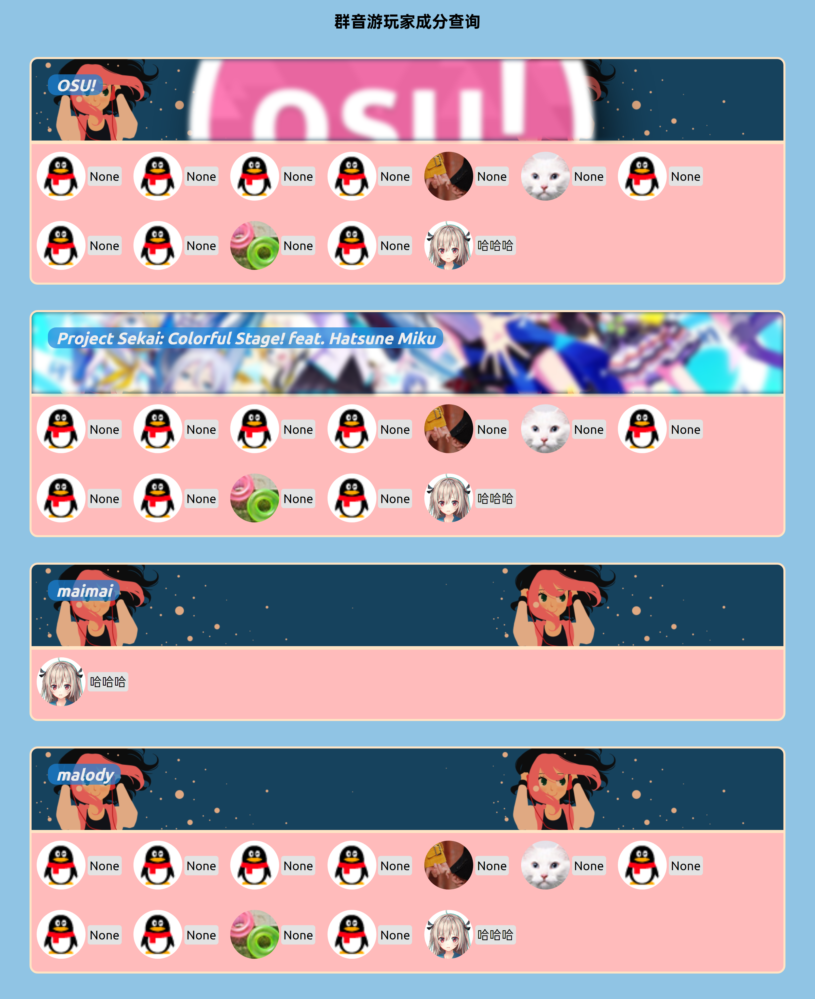

  
   
  

# nonebot-plugin-playercheck

_✨ NoneBot 一个查询群友音游成分的插件 ✨_

## 📖 介绍

将群友成分储存于json文件，并使用[nonebot-plugin-htmlrender](https://github.com/kexue-z/nonebot-plugin-htmlrender)渲染网页

## 💿 安装

使用 nb-cli 安装

在 nonebot2 项目的根目录下打开命令行, 输入以下指令即可安装

    nb plugin install nonebot-plugin-playercheck

使用包管理器安装

在 nonebot2 项目的插件目录下, 打开命令行, 根据你使用的包管理器, 输入相应的安装命令

pip

    pip install nonebot-plugin-playercheck

pdm

    pdm add nonebot-plugin-playercheck

poetry

    poetry add nonebot-plugin-playercheck

conda

    conda install nonebot-plugin-playercheck

打开 nonebot2 项目根目录下的 `pyproject.toml` 文件, 在 `[tool.nonebot]` 部分追加写入

    plugins = ["nonebot_plugin_playercheck"]

## ⚙️ 配置

*(可选)* 可以将本项目中的`assert`文件夹内的`assert.json`拖入你机器人目录的`/data/playercheck`文件夹内这样可以 **获取游戏别名和游戏图片**

## 🎉 使用
### 指令表
| 指令 | 权限 | 需要@ | 范围 | 说明 |
|:-----:|:----:|:----:|:----:|:----:|
| `cf.add` | 群员 | 否 | 群聊 | `cf.add osu,malody` 会替换原来的游戏列表 |
| `cf.del` | 群员 | 否 | 群聊 | 删除用户输入的所有游戏列表 |
| `cf.list` | 群员 | 否 | 群聊 | 渲染图片 |
### 效果图
> 如果没有从群内获取到该玩家的信息，则会返回None

## TO DO
- [ ] 按个人查询列表
- [ ] 优化代码结构
- [ ] 更好的数据管理方案
- [ ] 资源文件本地化